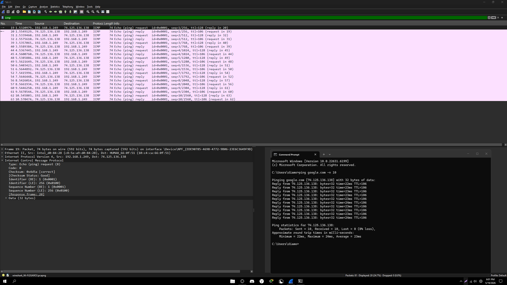
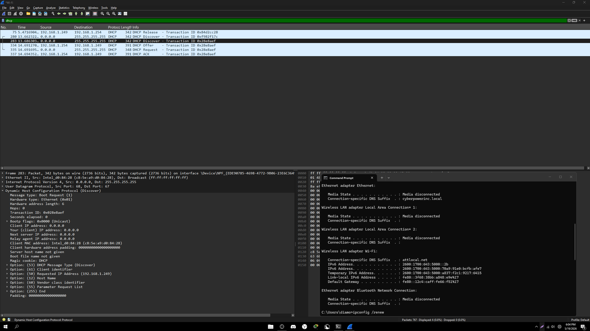
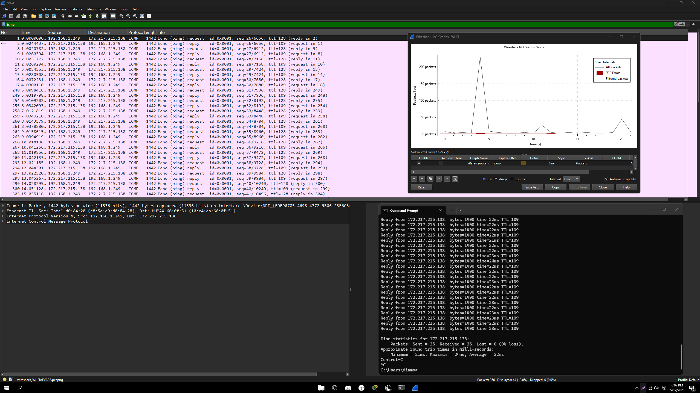

# Wireshark Network Traffic Analysis Lab
**Tools:** Wireshark | TCP/IP | DNS | ICMP | DHCP

## Overview
Captured and analyzed live network traffic using Wireshark to practice 
protocol-level fault diagnosis. Filtered and identified DNS resolution cycles, 
ICMP echo flows, DHCP lease negotiation, and degraded service indicators — 
the same triage methodology used when diagnosing trouble tickets in a NOC 
environment.

---

## Capture 1 — DNS Traffic Analysis
Captured DNS query and response cycles to understand how domain names 
resolve to IP addresses. Identified Standard query and Standard query response 
packets — the same process that fails during DNS-related outage tickets.

---

## Capture 2 — ICMP Traffic Analysis
Captured ICMP echo requests and replies using a continuous ping to google.com.
Analyzed request and reply pairs at the packet level — the same data used 
when verifying connectivity during network outage and degraded service tickets.

---

## Capture 3 — DHCP Traffic Analysis
Forced a DHCP lease release and renewal using ipconfig /release and /renew.
Captured the full DORA process live:
- Discover — client broadcasts requesting an IP
- Offer — server offers an available IP
- Request — client accepts the offer
- Acknowledge — server confirms the lease

---

## Capture 4 — Degraded Service Analysis
Simulated degraded service conditions using extended pings with large packet 
sizes. Used Wireshark IO Graph to visualize traffic flow over time — the same 
way a NOC monitoring tool displays interface utilization and packet loss trends.

---

## What This Lab Demonstrates
- DNS query and response cycle analysis at the packet level
- ICMP echo flow interpretation for connectivity verification
- Full DHCP DORA process captured on a live network
- Degraded service identification through packet loss and 
  latency analysis
- Protocol-level fault diagnosis methodology aligned with 
  NOC trouble ticket triage
